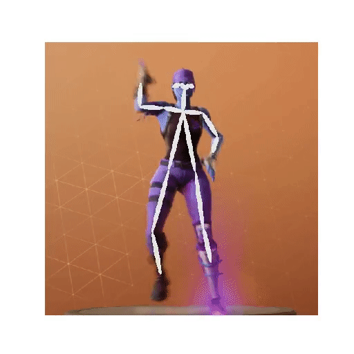

# fortnite_dances_real_life
Dance as Fortnite players using Artificial Intelligence.

Based on [nyoki-mtl](https://github.com/nyoki-mtl/pytorch-EverybodyDanceNow#pytorch-everybodydancenow) and [CUHKSZ-TQL](https://github.com/CUHKSZ-TQL/EverybodyDanceNow_reproduce_pytorch) implementation of [Everybody Dance Now](https://arxiv.org/abs/1808.07371) paper.

Use pytorch framework.

# Visualize Pose Stick
Can visualize pose stick representation of the person dancing.
Use script at `/src/utils/show_skeleton_on_RGB.py` to make an example.
First **must** have extracted **source** images and **label** images.

